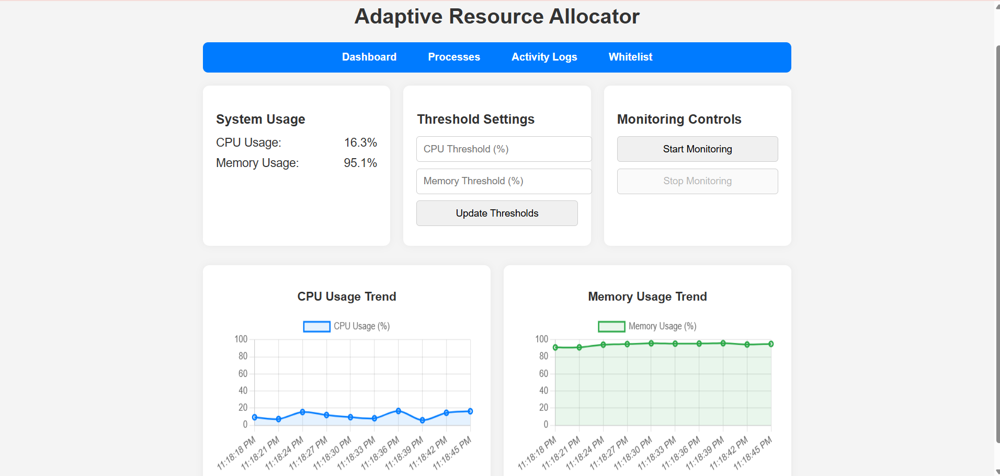
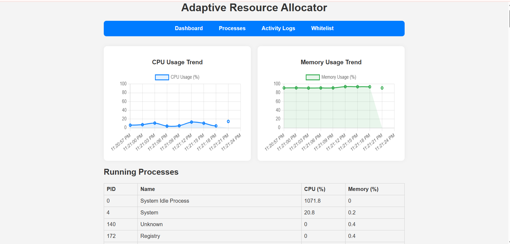
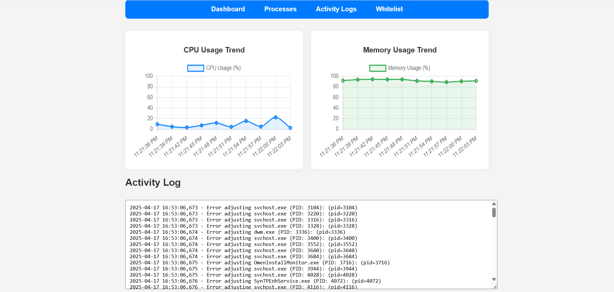
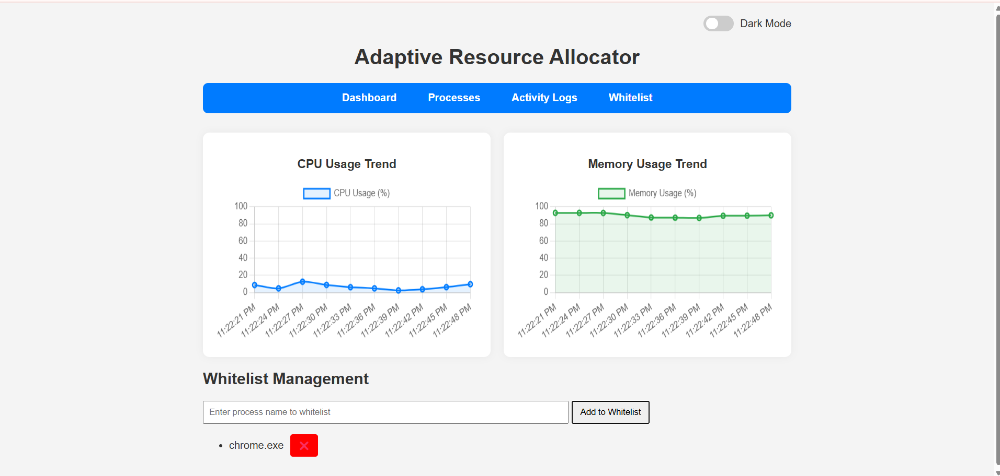

# 🎯 Adaptive Resource Allocator

A smart and lightweight system that dynamically adjusts CPU and memory allocation among processes in a multiprogramming environment. This project includes a real-time web dashboard built with Flask to monitor and control process priorities, helping optimize system performance and avoid bottlenecks.

---

## 📖 Description

The Adaptive Resource Allocator is designed to solve the issue of uneven resource usage in multiprogramming operating systems. It continuously monitors CPU and memory usage of all running processes and automatically changes their priorities when usage exceeds defined thresholds.

It offers a user-friendly web interface to view system metrics, adjust thresholds manually, manage whitelists, and start or stop the resource monitoring process.

---

## 🧠 Objective

- Improve performance by dynamically reallocating system resources.
- Prevent resource bottlenecks caused by high-demand processes.
- Provide a real-time dashboard for system monitoring and control.
- Enable whitelist management to exclude specific processes from priority changes.

---

## 🚀 Features

- ✅ Real-time CPU and Memory usage display  
- ✅ Automatic adjustment of process priorities  
- ✅ Start / Stop monitoring controls  
- ✅ Manual threshold setting (CPU & Memory)  
- ✅ Whitelist management for excluded processes  
- ✅ Sortable process table with current priority info  
- ✅ Lightweight and lag-free operation  

---

## 📁 Project Structure

adaptive-resource-allocator/ ├── app.py # Flask backend API ├── resource_allocator.py # Core logic for monitoring and priority adjustment ├── templates/ │ └── index.html # Main web UI ├── static/ │ ├── css/ │ │ └── style.css # Stylesheet for UI │ └── js/ │ └── script.js # JavaScript logic (fetch, update, control) ├── requirements.txt # Python dependencies └── README.md # Project documentation


---

## ⚙️ Requirements

- Python 3.x  
- Flask  
- psutil  

Install dependencies using:

```bash
pip install -r requirements.txt
```
## How To Run
1) Clone this repository 

git clone https://github.com/your-username/adaptive-resource-allocator.git
cd adaptive-resource-allocator

2) Run the Flask app

python app.py

3) Open your browser and go to

http://127.0.0.1:5000

You will see the dashboard with system matrics, controls, and process management tools.

## Screenshots
Dashboard View
Here’s how the dashboard looks:

Running Processes View

Activity Logs View

Whitelist View


## Technologies Used

Python
Flask
psutil
HTML/CSS/Javascript

## Authors 

Vinay -B.Tech, Computer Science, [Lovely Professional University]
Shubham -BTech, Computer Science ,[Lovely Professional University]
Rasin Haris -BTech, Computer Science ,[Lovely Professional University]


